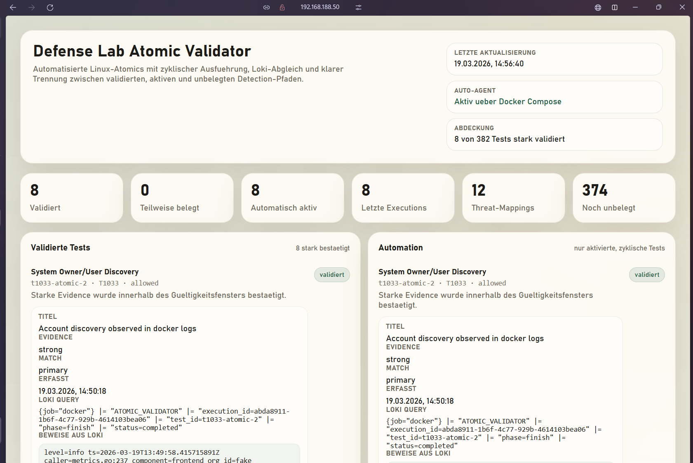

# 🗓️ Tag: 19.3.2026

## 🎯 Tagesziele
- Ziel 1: Atomic Validator im Monitoring-Stack sauber integrieren
- Ziel 2: zyklische Ausführung ungefährlicher Linux-Tests automatisieren
- Ziel 3: Weboberfläche verbessern und Evidence sichtbar machen

---

## ✅ Tagesresultate
Was habe ich heute konkret erreicht?

- Resultat 1: Der Atomic Validator wurde technisch in den Stack integriert und um API, Worker und Agent ergänzt.
- Resultat 2: Der Agent führt freigegebene Linux-Atomics nun automatisch im Loop aus und meldet die Executions an die API.
- Resultat 3: Die Weboberfläche wurde überarbeitet und zeigt jetzt besser lesbare Zeitstempel sowie Evidence für validierte Detection-Pfade an.
- Resultat 4: Die Policy wurde auf harmlose und reproduzierbare Linux-Tests reduziert.
- Resultat 5: Die Inventory-Logik wurde gehärtet, damit ein leeres Inventory erkannt und neu generiert wird.

---

## ⚠️ Probleme & Reflexion
Welche Probleme sind aufgetreten und wie habe ich sie gelöst?

**Problem:**
Die ersten Läufe erzeugten zwar Executions, aber viele Tests wurden nicht validiert oder blieben auf `pending`.

**Lösung:**
Ich habe den Logging-Pfad untersucht und die Marker `ATOMIC_VALIDATOR ...` zusätzlich direkt auf `stdout` ausgeben lassen, damit Promtail sie sicher aus den Docker-Logs nach Loki ingestieren kann. Danach konnten Worker-Queries starke Treffer erkennen.

**Reflexion:**
Nur weil ein Test ausgeführt wird, heisst das noch nicht, dass die Detection-Pipeline sauber nachweisbar ist. Für Security-Validierung ist der Logpfad genauso wichtig wie der eigentliche Test.

---

**Problem:**
Die Weboberfläche war unübersichtlich und später trat zusätzlich ein Inkonsistenzfall auf: Es gab Executions, aber gleichzeitig wurden 0 Tests angezeigt.

**Lösung:**
Ich habe die UI in KPI-Bereiche und klar getrennte Sektionen umgebaut. Zusätzlich wurde das Inventory-Loading gehärtet, damit ein leeres `linux_inventory.json` erkannt und automatisch neu erstellt wird.

**Reflexion:**
Eine Monitoring-Oberfläche ist nur dann nützlich, wenn Inkonsistenzen schnell sichtbar werden. Gute Visualisierung hilft direkt bei der Fehlersuche.

---

**Problem:**
Der Agent lief zwar im Loop, meldete aber zeitweise `eligible=0`.

**Lösung:**
Die Ursache war der State- und Cooldown-Mechanismus. Für die geplante zyklische Validierung wurde der Agent-Start so angepasst, dass die erlaubten Tests im Intervall wiederholt ausgeführt werden.

**Reflexion:**
Bei Testautomatisierung muss klar entschieden werden, ob Cooldowns Sicherheitsgrenzen schützen oder ob eine wiederholte Validierung beabsichtigt ist. Beides gleichzeitig führt schnell zu Missverständnissen.

---

## 📚 Eingesetzte Ressourcen
Welche Quellen habe ich benutzt?

- Projektinterne Konfigurationen und Compose-Dateien
- Atomic Red Team YAML-Dateien
- Loki / LogQL Abfragen im bestehenden Monitoring-Stack
- ChatGPT / KI Erklärung

**Kurz-Zusammenfassung der wichtigsten Erkenntnisse:**

- Ein Detection-Test ist erst dann wertvoll, wenn die zugehörige Evidence sauber gespeichert und angezeigt wird.
- Eine stark eingeschränkte und sichere Testmenge ist im Homelab sinnvoller als eine breite, unkontrollierte Atomic-Auswahl.
- Eine eigene Validierungsoberfläche macht den Unterschied zwischen Logsammlung und echter Detection-Prüfung sichtbar.

---

## 🧪 Eigene praktische Übung
Was habe ich selbst ausprobiert?

**Beschreibung der Übung:**
Ich habe einen Atomic-Validator-Workflow aufgebaut, bei dem sichere Linux-Tests automatisiert ausgeführt, an eine API gemeldet, in Loki gesucht und danach im Dashboard bewertet werden.

**Code / Umsetzung:**
```code
sudo docker compose run --rm \
  atomic-validator-api \
  python /app/agent/run_agent.py \
    --inventory /app/inventory/linux_inventory.json \
    --api-base http://atomic-validator-api:8090 \
    --host obababominecraft \
    --limit 3 \
    --force

curl -s http://localhost:8090/api/dashboard | jq '.summary'
sudo docker compose logs atomic-validator-worker --tail=100
```


